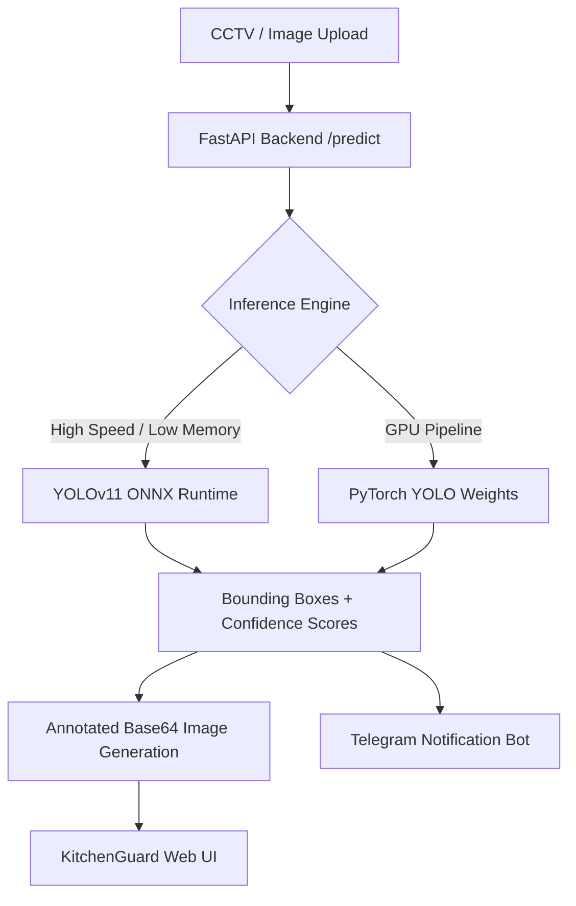

<div align="center">

# 🛡️ KitchenGuard AI
### Intelligent Computer Vision & Hygiene Compliance Monitoring for Commercial Kitchens

[](https://github.com/ultralytics/ultralytics)
[](https://fastapi.tiangolo.com/)
[](https://onnxruntime.ai/)
[](https://kitchen-guard-a1.vercel.app)
[](LICENSE)

**KitchenGuard AI** is a computer-vision powered safety and hygiene inspection platform designed to keep commercial kitchens audit-ready 24/7. It automatically detects Personal Protective Equipment (PPE) compliance, hygiene protocol breaches, and safety violations in real time from CCTV video feeds and image snapshots.

[🌐 Live Demo (Vercel)](https://kitchen-guard-a1.vercel.app) • [⚡ API Docs (Swagger)](https://kitchenguard-api-muhp.onrender.com/docs) • [📊 Model Benchmark](#-model-architecture--performance)

---

</div>

## 📌 Key Capabilities

- **Real-Time PPE Detection**: Instant multi-class object detection verifying `hairnet`, `apron`, `gloves`, `mask`, and flagging violations (`no_apron`, `no_gloves`, `no_hairnet`).
- **Sub-Second Inference**: Optimized ONNX Runtime engine achieving **<150ms** CPU latency and **<30ms** GPU latency.
- **Automated Telegram Alerts**: Instant notifications dispatched to floor managers with timestamped incident logs and violation summaries.
- **Regulatory Alignment**: Designed to assist compliance benchmarking against **HACCP**, **FDA 21 CFR Part 11**, and **ISO 22000**.
- **Interactive Web Sandbox**: Drag-and-drop live testing suite with visual bounding boxes, confidence tags, and hygiene telemetry.

---

## 🏗️ System Architecture



---

## 🏷️ Detected Classes

The model is trained on custom commercial kitchen datasets with **7 detection classes**:

| Class ID | Label | Category | Compliance Status |
| :---: | :--- | :---: | :---: |
| `0` | **`apron`** | PPE | ✅ Compliant |
| `1` | **`gloves`** | PPE / Hygiene | ✅ Compliant |
| `2` | **`hairnet`** | Headwear | ✅ Compliant |
| `3` | **`mask`** | Hygiene | ✅ Compliant |
| `4` | **`no_apron`** | Violation | ⚠️ Action Required |
| `5` | **`no_gloves`** | Violation | ⚠️ Action Required |
| `6` | **`no_hairnet`** | Violation | ⚠️ Action Required |

---

## 🚀 Quick Start

### 1. Clone the Repository
```bash
git clone https://github.com/BigSmokeweb/KitchenGuard-A1.git
cd KitchenGuard-A1
```

### 2. Set Up Virtual Environment
```powershell
# Windows
python -m venv venv
.\venv\Scripts\Activate.ps1

# Linux / macOS
python3 -m venv venv
source venv/bin/activate
```

### 3. Install Dependencies
```bash
pip install --upgrade pip
pip install -r requirements.txt
```

---

## 💻 Usage & Scripts

### 🔍 Run Image / Folder Inference
Run detection on images and export annotated results to `inference_outputs/test_images/`:
```bash
# Test sample image
python scripts/predict_image.py dataset/valid/images/sample.jpg

# Run with custom confidence & IOU thresholds
python scripts/predict_image.py --conf 0.35 --iou 0.45
```

### 🌐 Launch the FastAPI Inference Server
```bash
python scripts/server.py
```
* **API Endpoint**: `http://localhost:8000/predict`
* **Swagger Documentation**: `http://localhost:8000/docs`
* **Health Check**: `http://localhost:8000/health`

### 🏋️ Train Custom YOLO Model
```bash
python scripts/train.py --model yolo11n.pt --epochs 100 --imgsz 640 --batch 16
```

### 📊 Validate Dataset Structure & Distribution
```bash
python scripts/check_dataset.py
```

---

## 🤖 Telegram Bot Notifications *(Optional)*

To receive automated alerts on your phone whenever a kitchen safety infraction is detected:

1. Create a bot using [@BotFather](https://t.me/BotFather) and obtain your `TELEGRAM_BOT_TOKEN`.
2. Get your `TELEGRAM_CHAT_ID` using [@userinfobot](https://t.me/userinfobot).
3. Create a `.env` file in the root directory:
```env
TELEGRAM_BOT_TOKEN=your_bot_token_here
TELEGRAM_CHAT_ID=your_chat_id_here
```

---

## 📦 Directory Structure

```text
kitchen-hygiene-ai/
├── dataset/                    # Training and validation dataset
│   ├── data.yaml               # YOLO class mappings & split paths
│   ├── train/                  # Training images & labels
│   └── valid/                  # Validation images & labels
├── frontend/                   # Client-side web application
│   ├── main.js                 # Interactive sandbox & API client
│   ├── style.css               # Design system & dark-mode styling
│   ├── Kitchen_Img.png         # Demo benchmark image
│   └── Kitchen_Video.mp4       # Demo CCTV stream video
├── inference_outputs/          # Checkpoints & exported models
│   └── kitchen-hygiene-final/
│       └── weights/
│           ├── best.pt         # Full PyTorch YOLO weights
│           └── best.onnx       # Optimized ONNX deployment model
├── scripts/                    # Core pipeline scripts
│   ├── check_dataset.py        # Data verification & class balance check
│   ├── check_gpu.py            # CUDA hardware accelerator validator
│   ├── predict_image.py        # CLI inference tool
│   ├── server.py               # Production FastAPI REST API
│   └── train.py                # Model fine-tuning & training script
├── index.html                  # Main Web Portal
├── requirements.txt            # Python dependencies
└── README.md                   # Project documentation
```

---

## 📄 License & Attribution

This project is licensed under the **MIT License** - see the [LICENSE](LICENSE) file for details. Built by [Milind](https://github.com/BigSmokeweb).